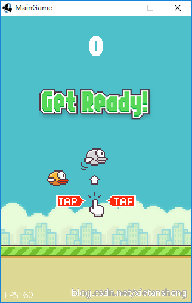
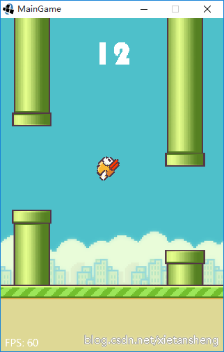

# FlappyBirdForGDX
使用跨平台游戏开发框架 LibGDX 开发的 Flappy Bird 《像素鸟》 游戏。

**声明**： 游戏中使用到的图片和音频资源来自网络，资源版权和游戏创意属原作者，这里仅供学习交流。

## 概述

《Flappy Bird》，中文名称《像素鸟》，是一款简单而富有挑战性的益智休闲游戏。玩家只需要用一个手指点击屏幕即可操作，手指点击一下屏幕，小鸟就会往上飞一点，受到重力作用，又会不停往下掉，所以玩家要控制小鸟一直向前飞行，并注意躲避途中高低不平的水管，每飞过一对水管，就增加得分。飞行过程中如果撞到水管或掉落在地板上则游戏结束。

## 游戏效果展示

HTML5 平台在线演示（浏览器需要支持 WebGL）： [http://xietansheng.github.io/FlappyBirdForGDX/](http://xietansheng.github.io/FlappyBirdForGDX/)

Desktop 平台项目运行截图：

 

## 详细介绍

[http://blog.csdn.net/xietansheng/article/details/50188319](http://blog.csdn.net/xietansheng/article/details/50188319)

